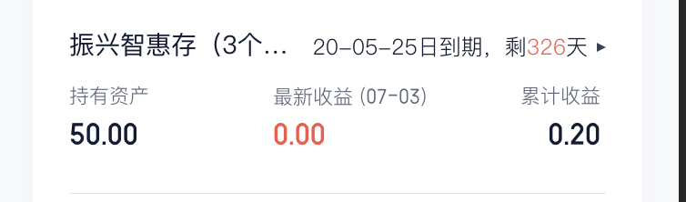

# 实现单行文本左右弹性溢出显示省略号

先看下处理的问题：

前：


后：


核心实现代码：

```html
<div class="wrapper">
    <span class="left">振兴智惠存（3个月）</span>
    <span class="right">20-11-10到期，剩336天</span>
</div>
```

```css
.wrapper {
    display: flex;
}
.left {
    white-space: nowrap;
    text-overflow: ellipsis;
    overflow: hidden;
}
.right {
    white-space: nowrap;
}
```

其实就是普通的省略号效果和`flex`布局的一个结合使用
